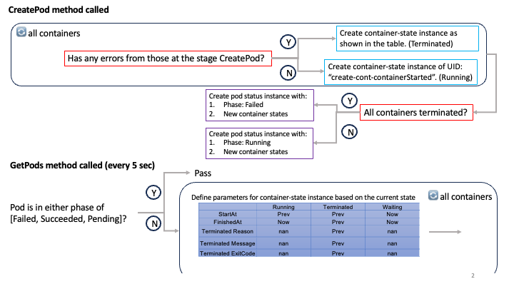
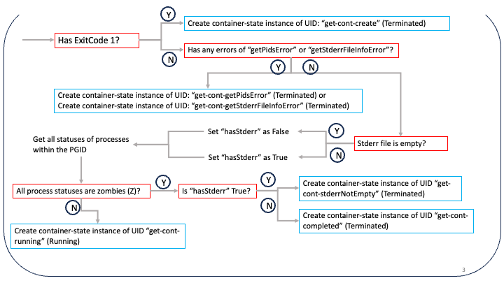
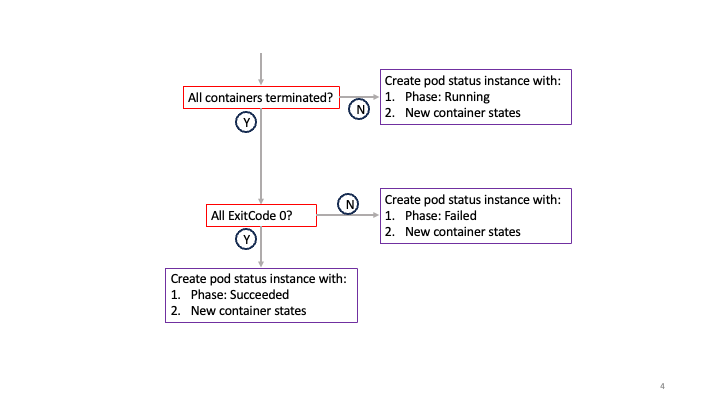

# Configuring Virtual-Kubelet-Cmd
## Using Shell Scripts to Start Virtual-Kubelet-Cmd
The `test-run/start.sh` script provides an example of how to initiate the VK. It does this by setting up specific environment variables.
```bash
#!/bin/bash
export MAIN="/workspaces/virtual-kubelet-cmd"
export VK_PATH="$MAIN/test-run/apiserver"
export VK_BIN="$MAIN/bin"

export APISERVER_CERT_LOCATION="$VK_PATH/client.crt"
export APISERVER_KEY_LOCATION="$VK_PATH/client.key"
export KUBECONFIG="$HOME/.kube/config"

export NODENAME="vk"
export VKUBELET_POD_IP="172.17.0.1"
export KUBELET_PORT="10255" 

export JIRIAF_WALLTIME="60" 
export JIRIAF_NODETYPE="cpu"
export JIRIAF_SITE="Local"

"$VK_BIN/virtual-kubelet" --nodename $NODENAME --provider mock --klog.v 3 > ./$NODENAME.log 2>&1 
```
## Environment Variables
| Environment Variable      | Description |
| ----------- | ----------- |
| `MAIN`      | Main workspace directory       |
| `VK_PATH`   | Path to the directory containing the apiserver files     |
| `VK_BIN`    | Path to the binary files       |
| `APISERVER_CERT_LOCATION`| Location of the apiserver certificate |
| `APISERVER_KEY_LOCATION` | Location of the apiserver key |
| `KUBECONFIG` | Points to the location of the Kubernetes configuration file, which is used to connect to the Kubernetes API server. By default, it's located at `$HOME/.kube/config`. |
| `NODENAME` | The name of the node in the Kubernetes cluster. |
| `VKUBELET_POD_IP` | The IP address of the VK that metrics server talks to. If the metrics server is running in a Docker container and VK is running on the same host, this is typically the IP address of the `docker0` interface. |
| `KUBELET_PORT` | The port on which the Kubelet service is running. The default port for Kubelet is 10250. This is for the metrics server and should be unique for each node. |
| `JIRIAF_WALLTIME` | Sets a limit on the total time that a node can run. It should be a multiple of 60 and is measured in seconds. If it's set to 0, there is no time limit. |
| `JIRIAF_NODETYPE` | Specifies the type of node that the job will run on. This is just for labeling purposes and doesn't affect the actual job. |
| `JIRIAF_SITE` | Used to specify the site where the job will run. This is just for labeling purposes and doesn't affect the actual job. |

# Running Pods on Virtual-Kubelet-Cmd Nodes
Pods, along with their associated containers, can be deployed on Virtual-Kubelet-Cmd (VK) nodes. The following table contrasts the capabilities of a VK node with those of a standard kubelet:

| Feature | Virtual-Kubelet-CMD | Regular Kubelet |
| ------- | ------------------- | --------------- |
| Container | Executes as a series of Linux processes | Runs as a Docker container |
| Image | Defined as a shell script | Defined as a Docker container image |

## Enhanced Features for Script Storage and Execution in Pods
| Feature | Description |
| ------- | ----------- |
| `configMap`/ `secret` | These are used as volume types for storing scripts during the pod launch process |
| `volumes` | This feature is implemented within the pod to manage the use of `configMap` and `secret` |
| `volumeMounts` | This feature is used to relocate scripts to the specified `mountPath`. The `mountPath` is defined as a relative path. Its root is structured as `$HOME/$podName/containers/$containerName` |
| `command` and `args` | These are utilized to execute scripts |
| `env` | This feature is supported for passing environment variables to the scripts running within a container |
| `image` | The `image` corresponds to a `volumeMount` in the container and shares the same name |

## Process Group Management in Containers Using `pgid` files
The `pgid` file is a feature used to manage the process group of a shell script running within a container. Each container has a unique `pgid` file to ensure process management. The `pgid` can be found at the following location: `$HOME/$podName/containers/$containerName/pgid`.


# Lifecycle of containers and pods
## Description of container states
The following tables provide a description of the container states and their associated methods.

### `CreatePod` method called, the following states are used:
| UID | Stage | State | StartAt | FinishedAt | ExitCode | Reason | Message | IsError | Description |
| --- | --- | --- | --- | --- | --- | --- | --- | --- | --- |
| create-cont-readDefaultVolDirError | CreatePod | Terminated | Start of pod | Now | 1 | readDefaultVolDirError | fmt.Sprintf("Failed to read default volume directory %s; error: %v", defaultVolumeDirectory, err) | Y | Scan the default volume directory for files |
| create-cont-copyFileError | CreatePod | Terminated | Start of pod | Now | 1 | copyFileError | fmt.Sprintf("Failed to copy file %s to %s; error: %v", path.Join(defaultVolumeDirectory, file.Name()), path.Join(mountDirectory, file.Name()), err) | Y | Copy the file to the mount directory |
| create--cont-cmdStartError | CreatePod | Terminated | Start of pod | Now | 1 | cmdStartError | cmd.Start() failed | Y | The command is initiated with cmd.Start(). |
| create-cont-getPgidError | CreatePod | Terminated | Start of pod | Now | 1 | getPgidError | failed to get pgid | Y | The process group id is retrieved using syscall.Getpgid(cmd.Process.Pid). |
| create-cont-createStdoutFileError | CreatePod | Terminated | Start of pod | Now | 1 | createStdoutFileError | failed to create stdout file | Y | The stdout file is created using os.Create(path.Join(stdoutPath, "stdout")). |
| create-cont-createStderrFileError | CreatePod | Terminated | Start of pod | Now | 1 | createStderrFileError | failed to create stderr file | Y | The stderr file is created using os.Create(path.Join(stdoutPath, "stderr")). |
| create-cont-cmdWaitError | CreatePod | Terminated | Start of pod | Now | 1 | cmdWaitError | cmd.Wait() failed | Y | A goroutine is initiated to wait for the command to complete with cmd.Wait() |
| create-cont-writePgidError | CreatePod | Terminated | Start of pod | Now | 1 | writePgidError | fmt.Sprintf("failed to write pgid to file %s; error: %v", pgidFile, err) | Y | Write the process group ID to a file |
| create-cont-containerStarted | CreatePod | Running | Start of pod | nan | nan | nan | nan | N | No error; init container state |

### `GetPods` method called, the following states are used:
| UID | Stage | State | StartAt | FinishedAt | ExitCode | Reason | Message | IsError | Description |
| --- | --- | --- | --- | --- | --- | --- | --- | --- | --- |
| get-cont-create | GetPods | Terminated | Prev | Prev | 1 | from those with ExitCode 1 | from those with ExitCode 1 | Y | Container failed to start |
| get-cont-getPidsError | GetPods | Terminated | Prev | Prev | 2 | getPidsError | Error getting pids | Y | Failed to get system PIDs |
| get-cont-getStderrFileInfoError | GetPods | Terminated | Prev | Prev | 2 | getStderrFileInfoError | Error getting stderr file info | Y | Failed to get info about stderr file of container |
| get-cont-stderrNotEmpty | GetPods | Terminated | Prev | Prev | 3 | stderrNotEmpty | The stderr file is not empty. | N | All processes are in Z. Stderr is not empty. Container is done with errors. |
| get-cont-completed | GetPods | Terminated | Prev | Prev | 0 | completed | Remaining processes are zombies | N | All processes are in Z. Stderr is empty. Container is done without errors. |
| get-cont-running | GetPods | Running | Prev | nan | nan | nan | nan | N | Not all processes are in Z. Container is running. |

### Field Descriptions
| Field        | Description |
|--------------|-------------|
| `UID`        | A unique identifier for container state. |
| `Stage`      | Method that container state is associated with. |
| `State`      | State of container. |
| `StartAt`    | Get time container started. `Prev` means time of previous state. `Now` means current time. |
| `FinishedAt` | Get time container finished. `Prev` means time of previous state. `Now` means current time. |
| `ExitCode`   | Exit code of container. |
| `Reason`     | Reason for container's state. `1`: Errors when `createPod` is called. `2`: Errors when `getPods` is called. `3`: stderr file is not empty. `0`: Container is completed. |
| `Message`    | Message associated with container's state. |
| `IsError`    | Boolean value that indicates whether container state is an error. |
| `Description`| Description of container's state. |

**Note:** The method `GetPods` is called every 5 seconds to check the state of the container. The method `CreatePod` is called when the pod is created.


## Flowchart for Creating and Monitoring the Lifecycle of Containers in a Pod
The following points describe the process of creating and monitoring containers and pods in the virtual-kubelet-cmd:

1. The `🔄 all containers` block indicates a loop that iterates over all containers in the pod.
2. The blocks in blue represent the process of creating container state instances.
3. The blocks in purple illustrate the process of creating and updating the pod status instances. This is based on the created container states and the pod phase.
4. The blocks in red depict the process of redirecting flows under various conditions.

**Note**: The Unique Identifier (UID) assigned to each container state is derived from the tables provided in the preceding section.






# Procedure to Deploy a Pod Executing a Shell Script
- The `image` field is defined as a shell script. This means that the `image` field corresponds to the name of `volumeMounts`.
- Use a `configMap` to store the shell script.
- Use `volumeMounts` to mount the script into the container.
- The `command` and `args` fields are used to execute the script.

Here's an example of how to create a pod that runs a shell script:
```yaml
kind: ConfigMap
apiVersion: v1
metadata:
  name: direct-stress
data:
  stress.sh: |
    #!/bin/bash
    stress --timeout $1 --cpu $2 # test memory
---
apiVersion: v1
kind: Pod
metadata:
  name: p1
  labels:
    app: new-test-pod
spec:
  containers:
    - name: c1
      image: direct-stress # this name should be the same as the name in the volumeMounts
      command: ["bash"]
      args: ["300", "2"] # the first argument is the timeout, and the second argument is the cpu number as defined in the stress.sh
      volumeMounts:
        - name: direct-stress
          mountPath: stress/job1 # the root path of the mountPath is $HOME/p1/containers/c1
  volumes:
    - name: direct-stress 
      configMap:
        name: direct-stress
```

# Running Pods on Virtual Kubelet Nodes
To schedule pods on Virtual Kubelet (VK) nodes, it's necessary to include specific labels in both `nodeSelector` and `tolerations`.
```yaml
nodeSelector:
    kubernetes.io/role: agent
tolerations:
  - key: "virtual-kubelet.io/provider"
    value: "mock"
    effect: "NoSchedule"
```

# Setting Affinity for Pods on Virtual Kubelet Nodes
- The affinity of pods for Virtual Kubelet (VK) nodes is determined by three labels: `jiriaf.nodetype`, `jiriaf.site`, and `jiriaf.alivetime`. These labels correspond to the environment variables `JIRIAF_NODETYPE`, `JIRIAF_SITE`, and `JIRIAF_WALLTIME` in the `start.sh` script.
- Note that if `JIRIAF_WALLTIME` is set to `0`, the `jiriaf.alivetime` label will not be defined, and therefore, the affinity will not be applied.
- To add more labels to the VK nodes, modify `ConfigureNode` in `internal/provider/mock/mock.go`.

```yaml
  affinity:
    nodeAffinity:
      requiredDuringSchedulingIgnoredDuringExecution:
        nodeSelectorTerms:
        - matchExpressions:
          - key: jiriaf.nodetype
            operator: In
            values:
            - "cpu"
          - key: jiriaf.site
            operator: In
            values:
            - "mylin"
          - key: jiriaf.alivetime # if JIRIAF_WALLTIME is set to 0, this label should not be defined.
            operator: Gt
            values:
            - "10"
```


# Metrics Server Deployment
The Metrics Server is a tool that collects and provides resource usage data for nodes and pods within a Kubernetes cluster. The necessary deployment configuration is located in the `metrics-server/components.yaml` file.

To deploy the Metrics Server, execute the following command:

```bash
kubectl apply -f metrics-server/components.yaml
```
**Note:** The flag `--kubelet-use-node-status-port` is added to the `metrics-server` container in the `metrics-server` deployment to allow the Metrics Server to communicate with the Virtual Kubelet nodes.


# Supporting Horizontal Pod Autoscaling (HPA) in Kubernetes

## Introduction

This document provides essential insights and solutions for the effective implementation of Horizontal Pod Autoscaling (HPA) in Kubernetes, specifically for VK. It emphasizes the importance of VK establishing accurate pod conditions, crucial for the optimal functioning of HPA. Check `test-run/HPA/README.md` for more details.

## Understanding Autoscaling through Code Analysis

The HPA mechanism relies heavily on specific Kubernetes code to evaluate pod readiness, especially concerning CPU resource scaling. The following snippet from the [Kubernetes source code](https://github.com/kubernetes/kubernetes/blob/v1.29.3/pkg/controller/podautoscaler/replica_calculator.go#L378) illustrates this process:

```go
if resource == v1.ResourceCPU {
    var unready bool
    _, condition := podutil.GetPodCondition(&pod.Status, v1.PodReady)
    if condition == nil || pod.Status.StartTime == nil {
        unready = true
    } else {
        if pod.Status.StartTime.Add(cpuInitializationPeriod).After(time.Now()) {
            unready = condition.Status == v1.ConditionFalse || metric.Timestamp.Before(condition.LastTransitionTime.Time.Add(metric.Window))
        } else {
            unready = condition.Status == v1.ConditionFalse && pod.Status.StartTime.Add(delayOfInitialReadinessStatus).After(condition.LastTransitionTime.Time)
        }
    }
    if unready {
        unreadyPods.Insert(pod.Name)
        continue
    }
}
```

This critical piece of logic helps ensure that only ready and appropriately initialized pods are considered for scaling actions based on CPU usage.

## Implementing Correct Pod Conditions

For HPA to function as intended, it's crucial to correctly set pod conditions upon creation and update their status based on lifecycle events accurately.

- **Pod Creation (`CreatePod`)**: The initial conditions for running and failed pods need to reflect their true state to avoid misinterpretation by the HPA logic. 
  - `startTime` is the time when the pod was created.
  - The `podReady` status is determined by the current phase of the pod:
    * If a pod has failed, `podReady` is set to False.
    * If a pod is currently running, `podReady` is set to True.
  - The conditions of the pod are updated as follows:

    ```go
    pod.Status.Conditions = []v1.PodCondition{
      {
        Type:               v1.PodScheduled,
        Status:             v1.ConditionTrue,
        LastTransitionTime: startTime,
      },
      {
        Type:               v1.PodReady,
        Status:             podReady,
        LastTransitionTime: startTime,
      },
      {
        Type:               v1.PodInitialized,
        Status:             v1.ConditionTrue,
        LastTransitionTime: startTime,
      },
    }

- **Retrieving Pods (`GetPods`)**: The operation of a pod is heavily dependent on its readiness status. This status is encapsulated by the `podReady` variable. Another significant attribute is `LastTransitionTime`, which records the time of the last status change.

    * `prevPodStartTime` is equivalent to `startTime` in the `CreatePod` method. 
    * `prevContainerStartTime[pod.Spec.Containers[0].Name]` denotes the start time of the first container in the pod. This holds true even for multiple containers, as they all initiate simultaneously.

  - The `podReady` status is determined by the current phase of the pod:
    * If a pod has either failed or succeeded, `podReady` is set to False.
    * If a pod is currently running, `podReady` is set to True.

  - The conditions of the pod are updated as follows:
      ```go
      Conditions: []v1.PodCondition{
        {
          Type:   v1.PodScheduled,
          Status: v1.ConditionTrue,
          LastTransitionTime: *prevPodStartTime,
        },
        {
          Type:   v1.PodInitialized,
          Status: v1.ConditionTrue,
          LastTransitionTime: *prevPodStartTime,
        },
        {
          Type:   v1.PodReady,
          Status: podReady,
          LastTransitionTime: prevContainerStartTime[pod.Spec.Containers[0].Name],
        },
      }
      ```

## Conclusion
Understanding and implementing pod condition checks correctly is crucial for effective use of Horizontal Pod Autoscaling in Kubernetes. By ensuring accurate status and condition reporting, we can enhance the reliability and efficiency of autoscaled deployments.


# Essential Scripts
The primary control mechanisms for the Virtual Kubelet (VK) are contained within the following files:
### Conclusion

Proper implementation and understanding of pod condition checks are paramount for the effective use of Horizontal Pod Autoscaling in Kubernetes. By ensuring accurate status and condition reporting, we can improve the reliability and efficiency of autoscaled deployments.


# Essential Scripts
The primary control mechanisms for the Virtual Kubelet (VK) are contained within the following files:
- `internal/provider/mock/mock.go`
- `internal/provider/mock/command.go`
- `internal/provider/mock/volume.go`


# References
- [virtual-kubelet](https://github.com/virtual-kubelet/virtual-kubelet)
- [systemk](https://github.com/virtual-kubelet/systemk)