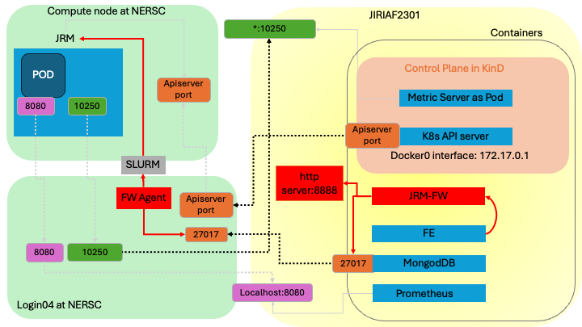

# JRM Deployment Using FireWorks

This guide provides an overview of the JRM deployment process. Two main components are involved in the deployment: the FireWorks launchpad and the JRM deployment script. The FireWorks launchpad is a MongoDB database that stores the JRM workflows, while the JRM deployment script is a bash script that sets up and runs a Docker container to launch Slurm jobs for deploying JRMs.


## FireWorks Launchpad Setup

We adopt FireWorks to manage the JRM deployment. The FireWorks is a workflow management system that facilitates the execution of complex workflows. Please check the [FireWorks](https://materialsproject.github.io/fireworks/) and [NERSC intro to FireWorks](https://docs.nersc.gov/jobs/workflow/fireworks/) for more details.


### Launchpad Configuration File for FireWorks
- The file `/FireWorks/util/my_launchpad.yaml` is a MongoDB configuration file for the launchpad used by FireWorks
- Make sure that the MongoDB port (default is `27017`) is accessible to the container. If it's not, verify if the port is open to all interfaces.

### Setup on the Database Server

- Establish the database and user as specified in the `my_launchpad.yaml` file. You can use the `FireWorks/util/create_db.sh` script to create the database and user.

### Setup on the Compute Node

- Prepare the Python environment according to the `requirements.txt` file.
- Use the `FireWorks/util/create_project.py` script to set up configuration files. This script will generate two files: `my_qadapter.yaml` and `my_fworker.yaml`. You can refer to the example files `FireWorks/util/my_launchpad.yaml` and `FireWorks/util/my_qadapter.yaml` for guidance.
- Make sure that the MongoDB is accessible from the compute node. If it's not, consider using SSH tunneling to establish a connection to MongoDB.


## JRM Deployment

Now that the FireWorks launchpad is set up, you can proceed with the JRM deployment. The deployment process involves the following steps:

### Prerequisites

One must have a NERSC account and have set up the private key (e.g. `~/.ssh/nersc`) for log into Perlmutter. This is due to the fact that the we set up three SSH connections to Perlmutter from the local machine.
1. Connect to FireWorks MongoDB database.
```python
cmd = f"ssh -i ~/.ssh/nersc -J {self.remote_proxy} -NfR 27017:localhost:27017 {self.remote}" 
```
2. Connect to the K8s API server.
```python
cmd = f"ssh -i ~/.ssh/nersc -J {self.remote_proxy} -NfR {apiserver_port}:localhost:{apiserver_port} {self.remote}" 
```
3. Connect to the JRM for metrics of the JRM.
```python
cmd = f"ssh -i ~/.ssh/nersc -J {self.remote_proxy} -NfL *:{kubelet_port}:localhost:{kubelet_port} {self.remote}" 
```

### Step 1: Create SSH Connections

Run the `jrm-create-ssh-connections` binary. It is an HTTP server that listens on port `8888`. This creates SSH connections (db port, apiserver port, and jrm port) as shown in the prerequisites for the JRM deployment. For more details, check the `create-ssh-connections/jrm-fw-create-ssh-connections.go` file.

Here's what it does:

1. Looks for available ports from `10000` to `19999` on localhost.
2. Runs the commands from `FireWorks/gen_wf.py` to create SSH connections.

**Note:** It considers listening ports as NOT available. So, ensure to delete ports that are not in use anymore when deleting JRMs.

**To-Do:** Add a feature to delete the ports. One can identify the ports by checking the database and searching for the Completed fireworks.


### Step 2: Configure Environment Variables
The `main.sh` script is responsible for initializing the environment variables required to launch JRMs. It sets the following variables:

- `nnodes`: This represents the number of nodes.
- `nodetype`: This defines the type of node.
- `walltime`: This is the walltime allocated for the slurm job and JRM.
- `nodename`: This is the name assigned to the node.
- `site`: This is the site name.
- `account`: This is the account number used for allocation at NERSC.

The script also creates a directory at `$HOME/jrm-launch/logs` to store logs. The path to this directory is saved in the `logs` environment variable.

If one needs to alter these environment variables, one can do so by modifying the `FireWorks/gen_wf.py` and `FireWorks/create_config.sh` files.

### Step 3: Execute the Script
Pull the docker image `jlabtsai/jrm-fw:latest` from Docker Hub. This image is used to run the JRM deployment. Execute the `main.sh` script. This script sets up and initiates a Docker container, which is used to launch Slurm jobs for deploying JRMs. The script accepts the following arguments:

1. `add_wf`: This argument adds a JRM workflow to the FireWorks database.
2. `get_wf`: This argument retrieves the table of workflows from the FireWorks database.
3. `delete_wf`: This argument removes a specific workflow from the FireWorks database.


## Walltime Discrepancy Between JRM and Slurm Job
The `JIRIAF_WALLTIME` variable in `FireWorks/gen_wf.py` is intentionally set to be `60 seconds` less than the walltime of the Slurm job. This is to ensure that the JRM has enough time to initialize and start running. 

Once `JIRIAF_WALLTIME` expires, the JRM will be terminated. The commands for tracking the walltime and terminating the JRM are explicitly defined in the `FireWorks/gen_wf.py` file, as shown below:

```bash
sleep $JIRIAF_WALLTIME
echo "Walltime $JIRIAF_WALLTIME has ended. Terminating the processes."
pkill -f "./start.sh"
```

## Network Map
Ports used in the JRM deployment:
- `27017`: MongoDB port
- `8888`: SSH connection port
- `API_SERVER_PORT`: K8s API server port
- `10250`: JRM port

SSH tunnelings:
On the local machine `JIRIAF2301`, we establish three SSH connections to `login04` on Perlmutter when deploying JRMs:
1. `27017:localhost:27017` for MongoDB
2. `API_SERVER_PORT:localhost:API_SERVER_PORT` for K8s API server
3. `*10250:localhost:KUBELET_PORT` for JRM metrics

One the compute node, we establish SSH tunneling for K8s API server and JRM metrics.

### Figure
