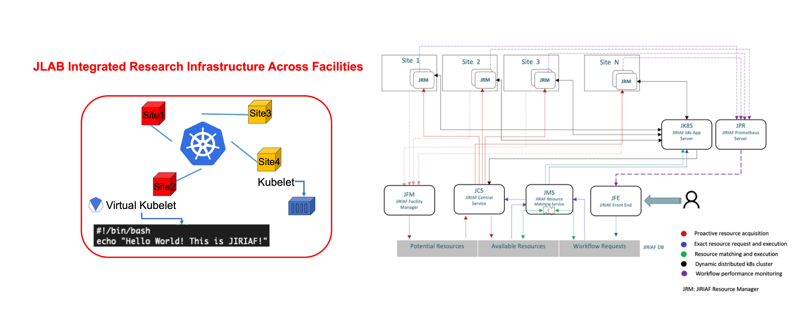

# JIRIAF (JLAB Integrated Research Infrastructure Across Facilities) - v0.1

## Introduction

The JIRIAF project aims to evaluate and implement the integration of geographically diverse computing facilities into a unified science infrastructure. Key aspects of this project include:

- Dynamically integrating temporarily unallocated or idle compute resources from various providers
- Studying challenges of heterogeneous, distributed, and opportunistic compute resource provisioning
- Presenting diverse resources to end-users as a single, unified computing infrastructure
- Developing policies and requirements for computational workflows that can effectively utilize volatile resources

Primary objectives:
1. Test relocation of computing workflows between geographically remote data centers
2. Understand optimal solutions, required future investments, and operational/sociological aspects of cross-site collaboration
3. Identify science workflows that benefit most from distributed infrastructure

The project aims to demonstrate workload rollovers across DOE computing facilities, providing operational resilience and load balancing during peak times. It will bring science-oriented computing facilities together, mandating uniform data movement, data processing API unification, and resource sharing.

Novelty: While static resource provisioning and dedicated resources (e.g., NERSC) exist, JIRIAF focuses on satisfying occasional, unscheduled tasks requiring timely processing. This includes workflows affected by maintenance periods, quick data QAs during acquisition, and fast analysis for physics checks.

The ultimate goal is to integrate DOE compute facilities in a way that appears as a single facility to users, eliminating the need for resource request proposals, approvals, or special memberships.

## JRM 
Please refer to the repositories in the [JRM](JRM) folder.
