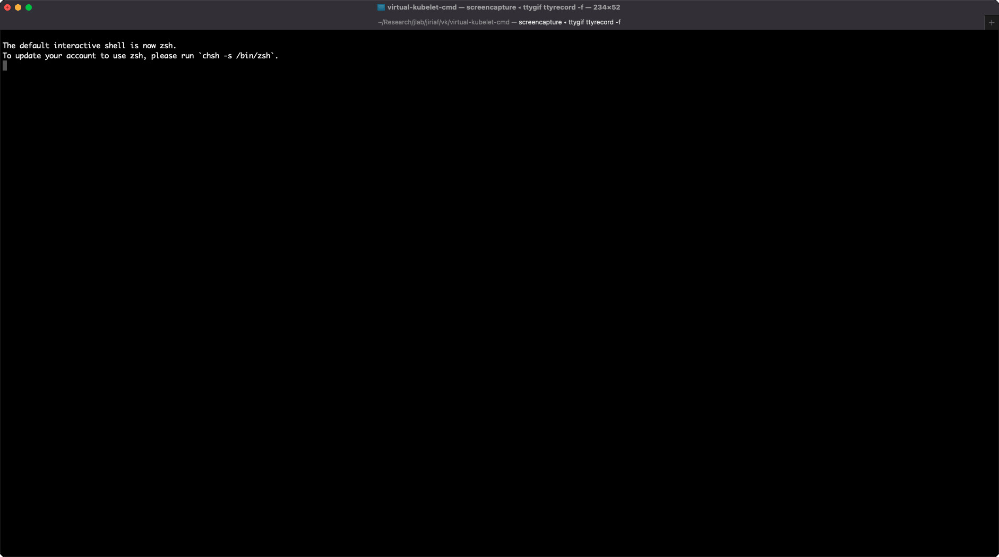
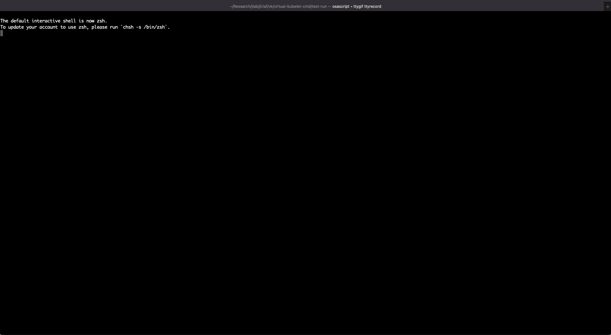
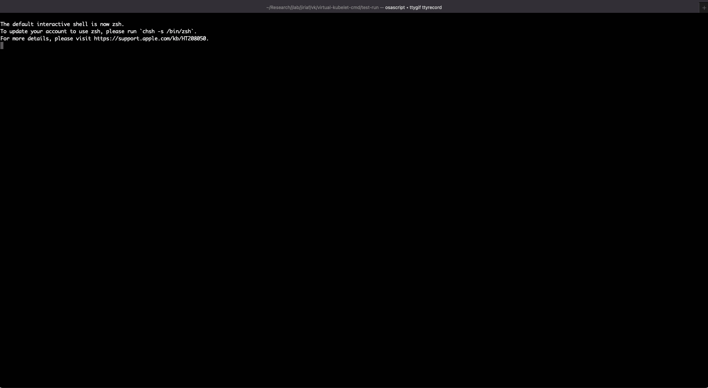

# BASH Shell Command Provider for Virtual Kubelet

This provider is a type of Virtual Kubelet that translates Kubernetes commands into BASH shell commands that can be run on the host. Instead of running a container, it runs shell commands directly on the host. This provider is based on the Virtual Kubelet (vk-mock) and is designed to run on resources where the container runtime is not directly accessible. We modified the `CreatePod` function in `mock.go` to execute the shell commands specified in the pod spec. Users can specify these commands in the pod spec, and they will be executed on the host shell.

## Pod Status

The status of the pod will be updated based on the status of the command that is executed. Here are the possible statuses:

- `CmdSucceeded`: The command has completed successfully, and the pod will be deleted.
- `CmdRunning`: The pod has been created, and the command is currently running.
- `CmdFailed`: The command has failed to run successfully. If you are using a UNIX pipe to run commands on the host from the container (e.g., `echo "cmd on host" > pipeline`), any errors from the command string ("cmd on host") will not be reflected in the pod status. Instead, you will need to check the `pipeline.out` file for the error message.

## Run virtual-kubelet-cmd in a Docker container
It is recommanded to run virtual-kubelet-cmd in a Docker container. To build the Docker image, please check the Github repository: [vk-cmd](https://github.com/tsaie79/vk-cmd).

## Demo 

This demo shows how to use virtual-kubelet-cmd to run shell commands directly on the host. Here are the demonstrations:

- Create a virtual-kubelet instance by running `make build` and go to `test-run` directory. Run `sh start.sh` to start the virtual-kubelet instance.

- Create a pod with a shell command. The command is specified in the `spec:containers[0]:command` field of the `test-run/job_pod_template.yaml` file. The pod status will be updated to `CmdSucceeded` when the command is completed successfully.

- Check the pod status while the command is running. The pod status will be updated to `CmdRunning`.

- Check the pod status when the command fails to run successfully. The pod status will be updated to `CmdFailed`.

## References

This package is based on the mock provider of [Virtual Kubelet](https://github.com/virtual-kubelet/virtual-kubelet), a Kubernetes kubelet implementation that masquerades as a kubelet running on a node. The mock provider is a type of Virtual Kubelet that can be used for testing and development purposes.